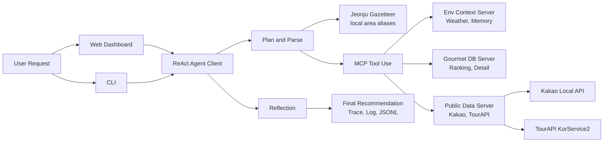

# ReAct-aurant

전주시 맛집 추천을 위한 ReAct 기반 AI Agent입니다. 사용자의 자연어 요청을 지역, 음식 종류, 날씨, 거리, 평점/후기 조건으로 분석하고, MCP 도구와 외부 API를 호출해 근거 있는 추천 결과를 생성합니다.

## 구조



| 영역 | 주요 파일 | 역할 |
| --- | --- | --- |
| Agent 실행 | `react_client.py` | 요청 분석, ReAct 루프, 도구 호출, Reflection, 최종 답변 생성 |
| 웹 UI | `web_dashboard.py` | 입력/출력, Trace, 실행 로그 확인용 로컬 대시보드 |
| 장소/API 도구 | `public_data_server.py` | Kakao Local API, TourAPI, 장소 링크 지표 보강 |
| 랭킹 도구 | `gourmet_db_server.py` | 후보 검색, 상세 조회, 점수화 |
| 환경 도구 | `env_context_server.py` | 날씨, 사용자 선호, 메모리 |
| 지역 사전 | `jeonju_gazetteer.py` | 전주시 세부 지역, 로컬 별칭, 상권 기준 반경 인식 |
| 테스트 | `tests/` | 핵심 로직, Agentic Pattern, 웹 대시보드 검증 |

## 실행 준비

Docker 웹 실행을 우선 권장하지만, 내부 Agent와 MCP 도구는 Python 런타임에서 동작합니다. 로컬에서 직접 실행하거나 테스트할 경우 아래 항목이 필요합니다.

| 항목 | 내용 |
| --- | --- |
| Python | 3.11 이상, 검증 환경은 Python 3.13 |
| Docker | 웹 대시보드 실행 시 사용 |
| Python 패키지 | `requirements.txt` 기준 설치 |
| 환경 변수 파일 | `.env.example`을 복사해 `.env`로 사용 |

필수 Python 패키지:

| 패키지 | 역할 |
| --- | --- |
| `mcp` | MCP 서버/클라이언트 실행 |
| `pydantic` | Agent 요청/응답 모델 검증 |
| `python-dotenv` | 로컬 `.env` 로드 |
| `httpx` | Kakao Local API, TourAPI HTTP 호출 |
| `openai` | GPT 기반 판단, Reflection, 최종 답변 생성 |

Python 환경을 직접 준비할 때는 다음 순서로 설치합니다.

```powershell
py -3.13 -m venv .venv
.\.venv\Scripts\activate
python -m pip install --upgrade pip
python -m pip install -r requirements.txt
```

## Docker 웹 실행

웹 대시보드 실행을 우선 권장합니다. 입력, 최종 추천, 자연어 Trace, 코드 흐름 Trace, 실행 로그, JSONL Trace를 한 화면에서 확인할 수 있습니다.

```powershell
docker compose up --build
```

접속 주소:

```text
http://127.0.0.1:18765/app
```

종료:

```powershell
docker compose down
```

웹 실행 기록은 `logs/web_runs`에 저장됩니다. 이 경로는 Git 추적에서 제외됩니다.

추천 결과의 `적용 조건`에는 지역, 음식 종류, 거리와 함께 `검색범위`가 표시됩니다. 예를 들어 `전북대 근처`는 전북대 캠퍼스 주변 상권으로 넓게 보고 구정문·신정문 권역을 포함하며, `전북대 구정문 근처`는 구정문 중심 상권으로 좁게 처리합니다.

## 환경 변수

`.env.example`을 복사해 로컬 `.env`를 만든 뒤 필요한 값만 입력합니다. `.env`는 GitHub에 올리지 않습니다.

```powershell
copy .env.example .env
```

```env
OPENAI_API_KEY=
KAKAO_REST_API_KEY=
TOUR_API_SERVICE_KEY=
```

## CLI 실행

CLI는 웹 대시보드 없이 Agent 흐름과 Trace를 확인할 때 사용합니다.

Kakao Local API 기반 실행:

```powershell
.\.venv\Scripts\python react_client.py "전주 객사 근처에서 친구랑 저녁 먹기 좋은 맛집을 찾아줘. 너무 비싸지 않고, 리뷰가 좋은 곳 위주로 3곳 추천해줘." --data-source kakao --trace logs\trace_required.jsonl
```

비용을 줄이는 규칙 기반 실행:

```powershell
.\.venv\Scripts\python react_client.py "전주 객사 한식 맛집 추천" --data-source tourapi --no-llm --trace logs\trace_no_llm.jsonl
```

## 문서

자세한 설계와 사용 방법은 아래 문서를 참고합니다.

| 문서 | 내용 |
| --- | --- |
| `EXECUTION_ENVIRONMENT.md` | 실행 환경, Python/Docker 실행 방법, 환경 변수 |
| `AGENTIC_DESIGN_PATTERNS.md` | 적용한 Agentic Design Pattern |
| `EXTERNAL_API_USAGE.md` | Kakao Local API, TourAPI, OpenAI API 사용 방법 |
| `SUBMISSION_GUIDE.md` | 실행 화면, 실행 로그, Trace 정리 방법 |

## 검증

```powershell
.\.venv\Scripts\python -m unittest discover -s tests
.\.venv\Scripts\python -m py_compile react_client.py public_data_server.py gourmet_db_server.py env_context_server.py web_dashboard.py
```

## Git 제외 항목

`.env`, `.venv`, `__pycache__`, `node_modules`, `logs`, `data/cache`, `docs`, `.pytest_cache` 등 로컬 실행 산출물과 비밀 값이 포함될 수 있는 항목은 Git 추적에서 제외합니다.
